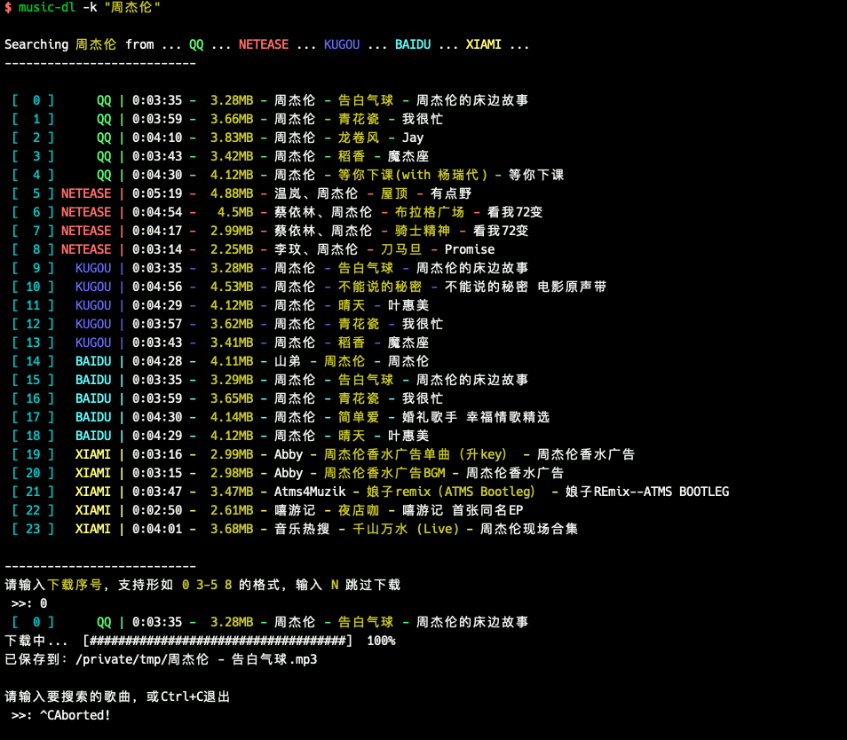
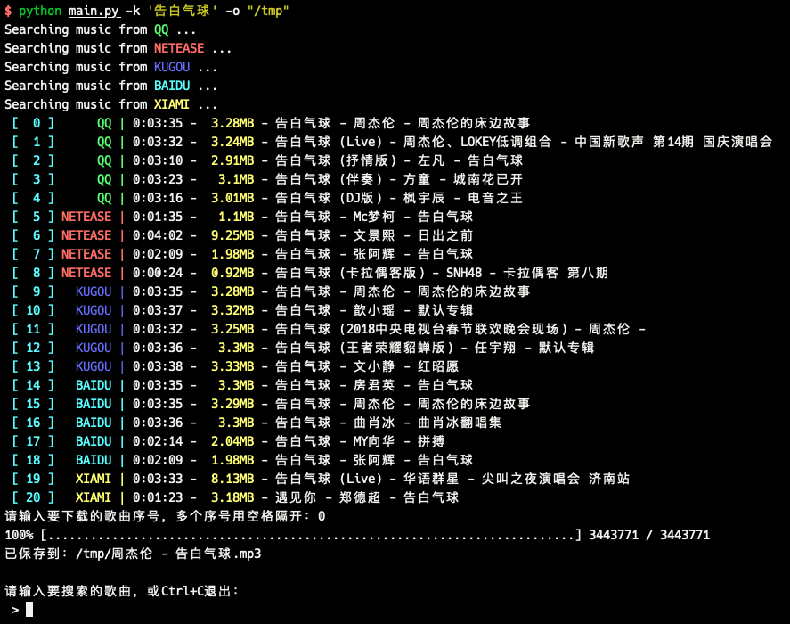
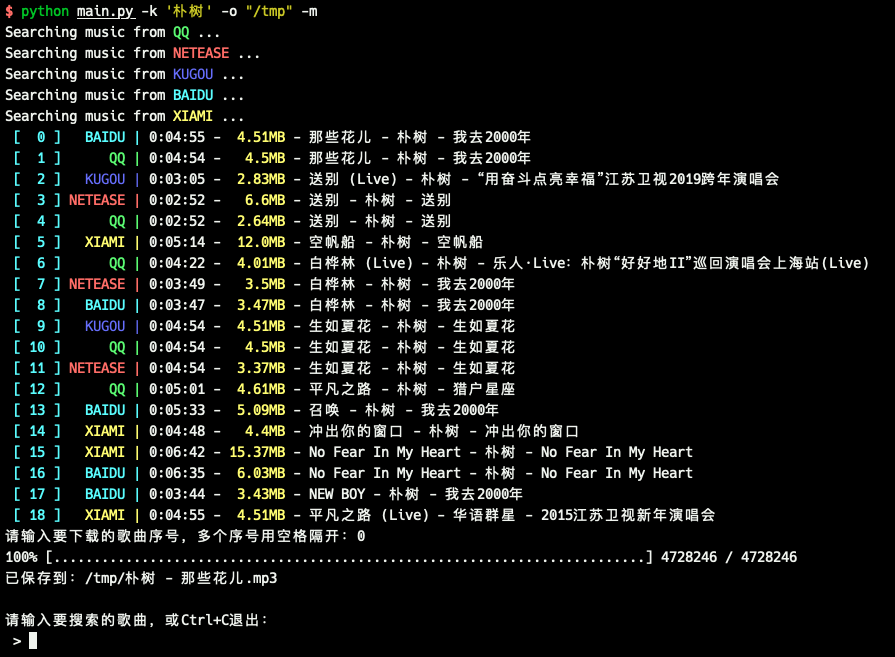

# music-dl
从网易云音乐、QQ音乐、酷狗音乐、百度音乐、虾米音乐等搜索和下载歌曲。

Search and download music from netease, qq, kugou, baidu and xiami.

> 注意：部分音乐源在一些国家和地区不可用，可以考虑使用中国大陆代理。

> Note: Some music sources may not be available in some countries and regions. If so, you should use Chinese proxies. See <https://github.com/0xHJK/Proxies> for public proxies.

## Feature

- 支持指定搜索数量、音乐源和保存目录（默认搜索全部音乐源，数量为5）
- 支持无损音乐搜索（数量较少，默认不打开）
- 搜索音质优先级由高到低（flac -> 320K -> 128K)
- 支持http代理和socks代理（海外党福音）
- 支持多线程搜索
- 支持排序和去重（默认不去重）

在以下环境测试通过（仅支持Python3）：

| 系统名称 | 系统版本      | Python版本 |
| -------- | -------------- | ---------- |
| macOS    | 10.14          | 3.7.0      |
| macOS    | 10.13          | 3.7.0      |
| Windows  | Windows 7 x64  | 3.7.2      |
| Windows  | Windows 10 x64 | 3.7.2      |
| Ubuntu   | 16.04 x64      | 3.5.2      |


## 免责声明

- 本工具只用作个人学习研究，禁止用于商业及非法用途，如产生法律纠纷与本人无关。
- API来自网络，非官方API，随时可能失效。
- 音乐版权归各网站所有，本工具主要目的是协助搜索，发现哪家音乐有版权。
- 音乐仅用于试听，如果需要保存，请自行去各个网站下载正版。

## 提Issues说明

- **检查是否是最新的代码，检查是否是Python3，检查依赖有没有安装完整**。
- 说明使用的操作系统，例如Windows 10 x64
- 说明Python版本，以及是否使用了pyenv等虚拟环境
- 说明使用的命令参数、搜索关键字和出错的音乐源
- 使用`-v`参数重试，说明详细的错误信息，最好有截图
- 如果有新的思路和建议也欢迎提交

## Usage 使用方式

安装依赖：

```
$ pip3 install -r requirements.txt
```

使用帮助：

```
$ python3 main.py -h
usage: python main.py [-k keyword] [-s source] [-c count] [-o outdir] [-v] [-m]
	-h --help        帮助
	-v --verbose     详细模式
	-m --merge       对搜索结果去重和排序
	--nomerge        对搜索结果不去重（默认不去重）
	-k --keyword=    搜索关键字
	-s --source=     数据源目前支持qq netease kugou baidu xiami flac
	-c --count=      数量限制
	-o --outdir=     指定输出目录
	-x --proxy=      指定代理（如http://127.0.0.1:1087）
example: python main.py -k "周杰伦" -s "qq netease kugou baidu xiami" -c 10 -o "/tmp"
```

- 默认搜索所有音乐源，每个数量限制为5，保存目录为当前目录，不合并搜索结果。
- 指定序号时可以使用`1-5 7 10`的形式。
- 需要合并搜索结果时，排序顺序按照歌手和歌名排序，当两者都相同时保留最大的文件。
- 无损音乐歌曲数量较少，如果没有无损会显示320K或128K，建议只在搜索特定歌曲名时手动打开`-s flac`
- 支持http代理和socks代理，使用`-x http://127.0.0.1:1087`或`-x socks5://127.0.0.1:1086`打开该功能

获取公共代理的方式可以参考我的另一个项目<https://github.com/0xHJK/Proxies>，100行Python代码快速获得一个代理池，两分钟获得数千个有效代理。

Example 使用示例：



去重效果展示（早期版本截图）：

Before merge 去重前：



After merge 去重后：



## Music sources 支持音乐源列表
| 音乐源     | 缩写    | 网址                    |
| ---------- | ------- | ----------------------- |
| QQ音乐     | qq      | <https://y.qq.com/>     |
| 酷狗音乐   | kugou   | <http://www.kugou.com/> |
| 网易云音乐 | netease | <https://music.163.com/>  |
| 百度音乐   | baidu   | <http://music.baidu.com/> |
| 虾米音乐   | xiami   | <https://www.xiami.com/>  |
| 百度无损音乐   | flac   | <http://music.baidu.com/> |

欢迎提交插件支持更多音乐源！插件写法参考`core/extractors`中的文件


## 更新记录
- 2019-01-26 支持http和socks代理，删除wget库，新增click库，发布v1.1版
- 2019-01-25 支持百度无损音乐
- 2019-01-24 优化交互、修复bug
- 2019-01-22 解决Windows兼容问题，支持多线程，发布v1.0版
- 2019-01-21 支持虾米音乐，支持去重
- 2019-01-20 支持百度音乐
- 2019-01-17 支持指定目录、数量、音乐源
- 2019-01-12 QQ音乐320K失效
- 2019-01-11 支持网易云音乐
- 2019-01-09 完成v0.1版，支持酷狗和QQ

## Credits 致谢
本项目受以下项目启发，参考了其中一部分思路，向这些开发者表示感谢。
- <https://github.com/soimort/you-get>
- <https://github.com/maicong/music>
- <https://github.com/YongHaoWu/NeteaseCloudMusicFlac>

## LICENSE

WTFPL
