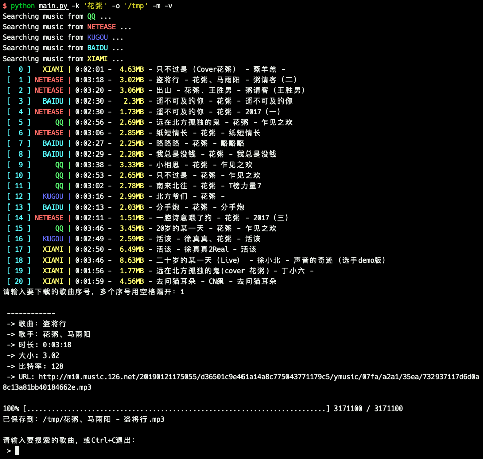

# music-dl
search and download music from netease, qq, kugou and baidu.

从网易云音乐、QQ音乐、酷狗音乐、百度音乐等搜索和下载歌曲

You can specify music sources and limit count of search results. 

The default priority is to try to download 320K music, then 128K.

支持指定搜索数量和音乐源，默认优先尝试下载320K，如果没有320K会下载128K。

由于各大音乐网站限制，高品质音乐一般只能通过会员下载。

> Note: Python3 only. Some music sources may not be available in some countries and regions. If so, you can use Chinese proxies.

> 注意：仅支持python3，在python3.7.0运行通过。部分音乐源在一些国家和地区不可用，可以考虑使用中国大陆代理。

Normal 普通模式：


Merge 去重模式：


Verbose 详细模式：


## Usage 使用方式
```
$ python main.py -h
usage: python main.py [-k keyword] [-s source] [-usage: python main.py [-k keyword] [-s source] [-c count] [-o outdir] [-v]
	-h --help        帮助
	-v --verbose     详细模式
	-m --merge       对搜索结果去重和排序
	--nomerge        对搜索结果不去重
	-k --keyword=    搜索关键字
	-s --source=     数据源目前支持qq netease kugou baidu xiami
	-c --count=      数量限制
	-o --outdir=     指定输出目录
example: python main.py -k "周杰伦" -s "qq netease kugou baidu xiami" -c 10 -o "/tmp"
```

默认搜索所有音乐源，每个数量限制为5，保存目录为当前目录，不合并搜索结果，指定序号时可以使用`1-5 7 10`的形式。排序顺序按照歌名-歌手-文件大小依次排序，当三者都相同时判断为相同歌曲。

> 注意：如果经常需要指定数量、目录等参数可以考虑修改glovar.py中的变量

## Music sources 支持音乐源列表
Supported 已支持
- [x] qq       QQ音乐 <https://y.qq.com/>
- [x] kugou    酷狗音乐 <http://www.kugou.com/>
- [x] netease  网易云音乐 <https://music.163.com/>
- [x] baidu    百度音乐 <http://music.baidu.com/>
- [x] xiami    虾米音乐 <https://www.xiami.com/>

Not yet 待支持
- [ ] kuwo     酷我音乐 <http://www.kuwo.cn/>

欢迎提交插件支持更多音乐源！插件写法参考`core/extractors`中的文件


## Credits 致谢
本项目受以下项目启发，参考了其中一部分思路，向这些开发者表示感谢。
- <https://github.com/soimort/you-get>
- <https://github.com/maicong/music>

## LICENSE

WTFPL
